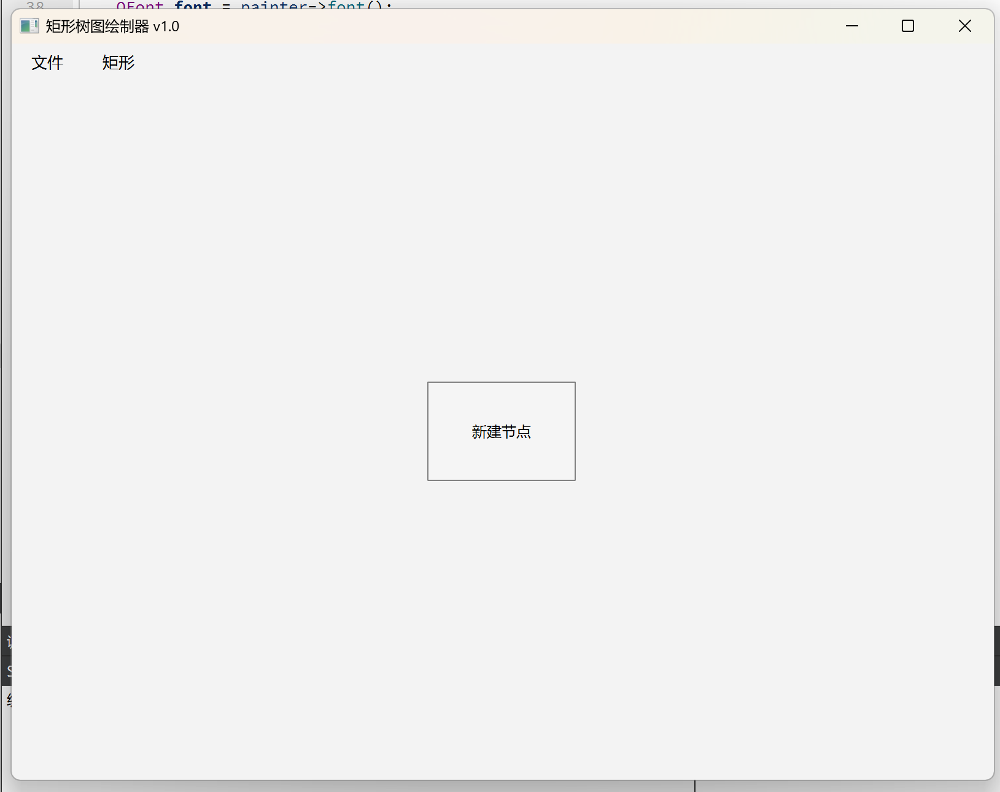
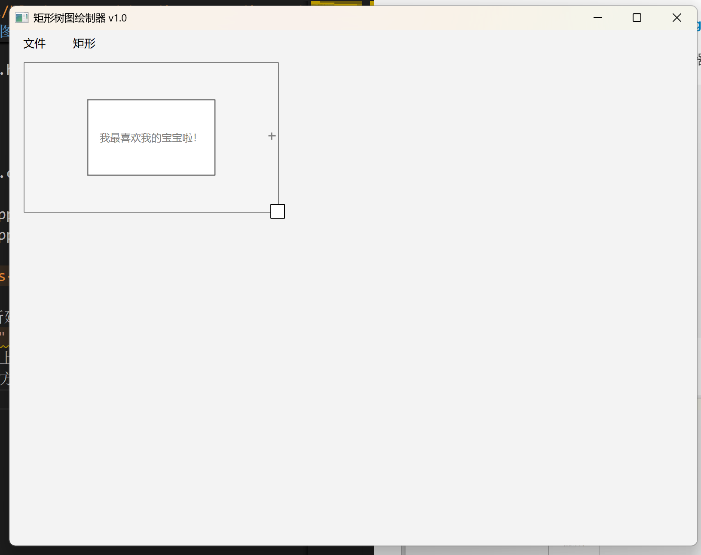
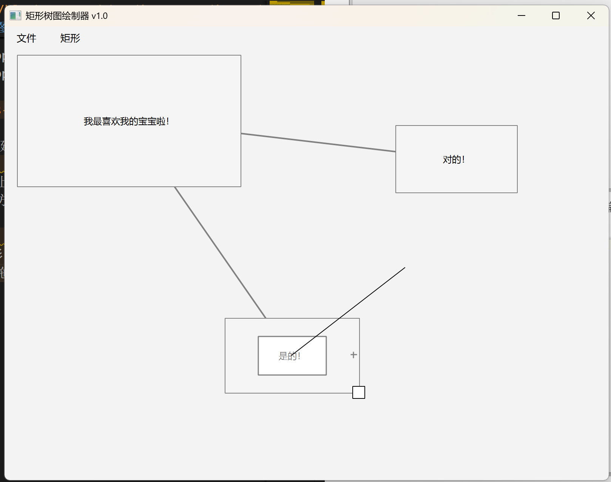
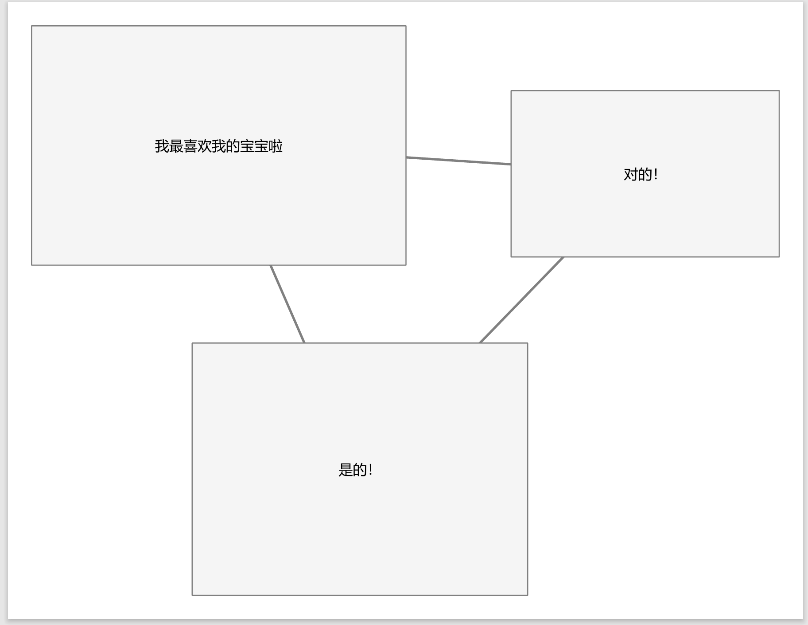
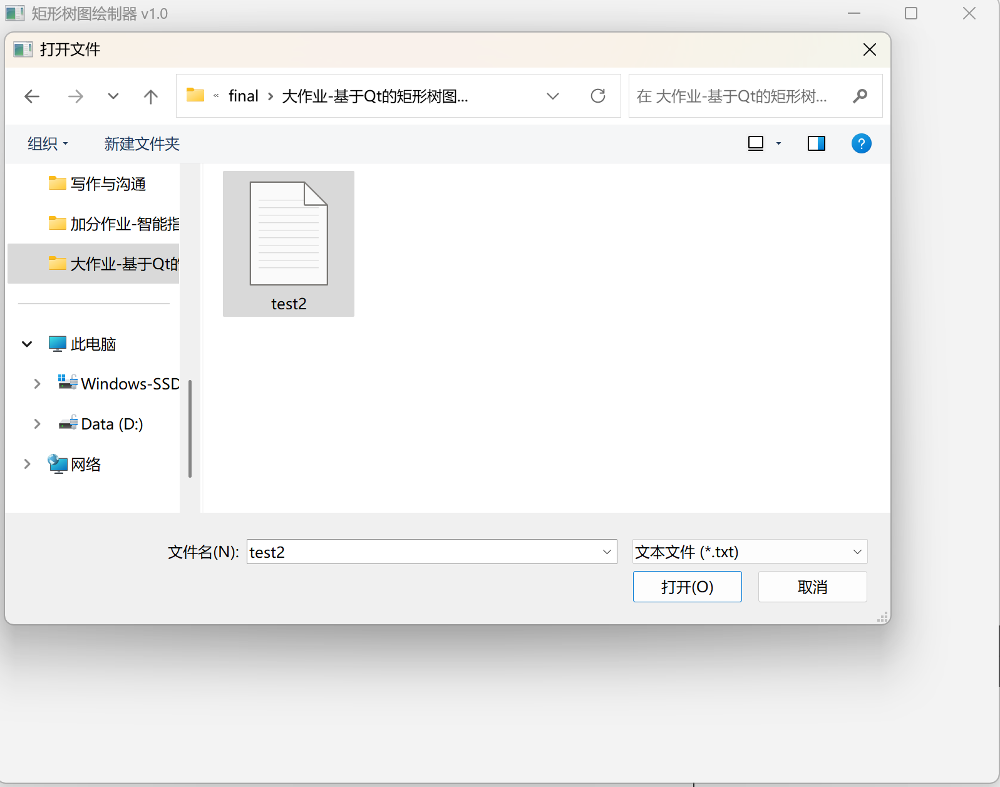

# Report Document  
#### Qt-based Treemap Renderer  
**Sihan Lyu, Class Dushi 43, Student ID 2024013318**  
**lvsh24@mails.tsinghua.edu.cn**  

Based on Qt 6.9, this program implements a simple treemap renderer. The code file structure is as follows:  
```
|-Configuration files
    |-CMakeLists.txt
|-Header files
    |-canvaswidget.h
    |-treenode.h
    |-connection.h
    |-mainwindow.h
|-Source files
    |-canvaswidget.cpp
    |-treenode.cpp
    |-connection.cpp
    |-mainwindow.cpp
    |-main.cpp
```

### Functional Testing:  
1. Run the program and press `Ctrl+R` to create a new rectangle:  
  

2. Hover the mouse over the rectangle:  
   - A text edit box appears at the center  
   - A resize handle (small square) appears at the bottom-right corner  
   - Drag outside the edit box to move the rectangle:  
  

3. Create two more rectangles using the same method.  
   When hovering over a rectangle, a small plus icon appears on the right.  
   Click and drag the plus icon to draw connections:  
  

4. Press `Ctrl+P` to save as PDF (test1.pdf in the same directory):  
  

5. Press `Ctrl+S` to save as a self-describing TXT file (test2.txt):  
  

6. Press `Ctrl+N` to clear the canvas, then `Ctrl+O` to open test2.txt:  
  
The previously saved canvas is successfully restored.  